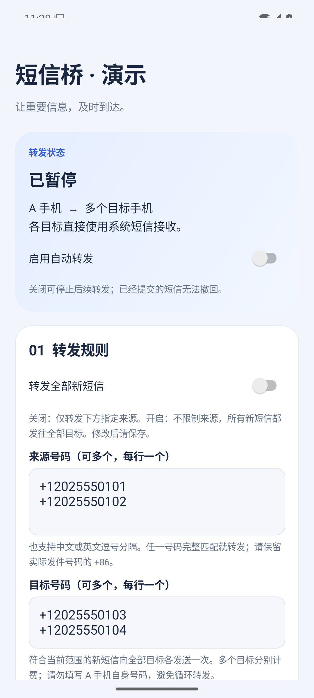

# SMS Bridge for Android

Forward new SMS from your Android phone to your other phone numbers using a selected SIM. No server and no app on the receiving phones.

[中文](README.md) · [Download](https://github.com/lizhicaho/sms-bridge-android/releases/latest)

## Features

- Exact sender allowlist or explicitly enabled all-new-messages mode.
- Multiple recipients, individual submission status, multipart SMS.
- Persistent event deduplication. Failed or unknown attempts are never automatically retried.
- Last 200 per-recipient attempts with original message bodies.
- No INTERNET or READ_SMS permission, analytics, or application backend.

## Preview

Screenshots use an isolated demo build with fictitious numbers and synthetic status records. They show actual Android UI, not successful carrier delivery. The demo cannot send or receive SMS.

## Setup

Install the release APK on the sending Android phone. Grant RECEIVE_SMS, SEND_SMS and READ_PHONE_STATE, configure recipients and the sending SIM, save, then confirm a test message on each recipient before enabling forwarding. Allow background execution as required by your device. Open the app after force-stop and unlock after reboot.

Android 8.0+ is the minimum, not a guarantee of device compatibility. OEM restrictions and OTP protections can delay or prevent reception. HarmonyOS 5+, iOS, MMS and RCS are not supported targets.

Forwarding incurs carrier charges, potentially per recipient and per segment. Do not forward to the sending phone itself or create forwarding loops. All-message mode includes private messages and verification codes. Use only on devices you own or are authorized to manage.

## Privacy and reliability

Bodies are retained in app-private local storage; app backup is disabled. The system messaging app and carrier may keep sent-message records. There is no hidden-send mode. A successful send callback does not prove recipient delivery. A crash between persistence and modem submission may leave an unknown record without sending; there is no retry queue.

## Build

Use JDK 17, Android SDK 35, Build Tools 35.0.0 and the included Gradle wrapper:

~~~sh
./gradlew testDebugUnitTest lintDebug assembleRelease
ANDROID_HOME=/path/to/sdk scripts/package-local.sh
~~~

Keep .signing/ private and backed up. Independently signed builds cannot replace official installations without uninstalling.

See [contributing](CONTRIBUTING.md), [security](SECURITY.md), [third-party notices](THIRD_PARTY_NOTICES.md) and [MIT license](LICENSE).
