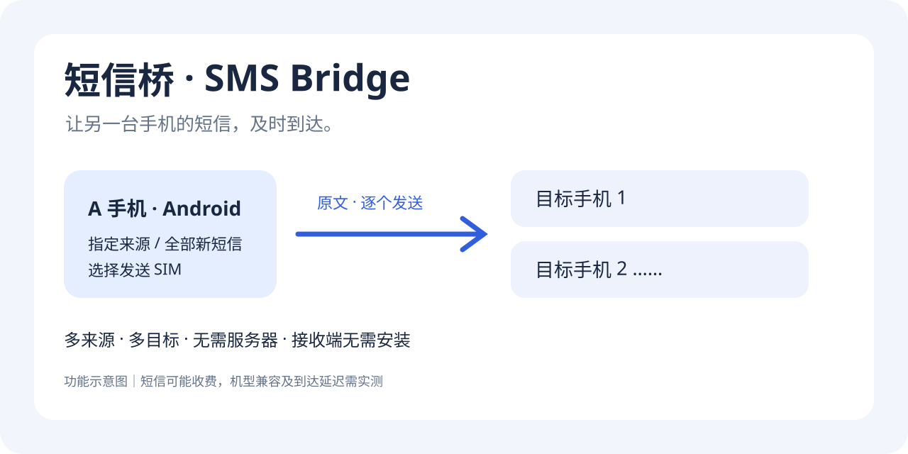
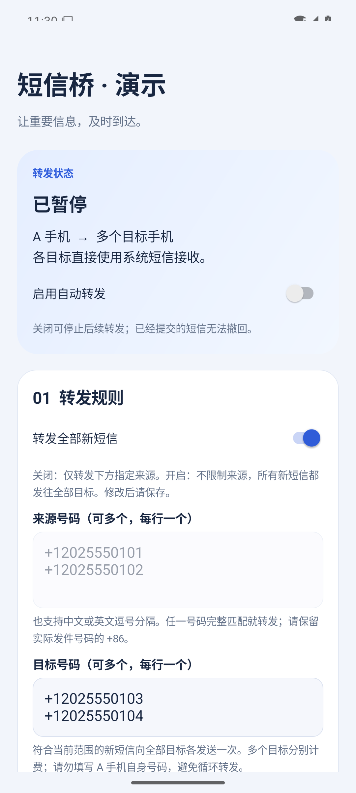
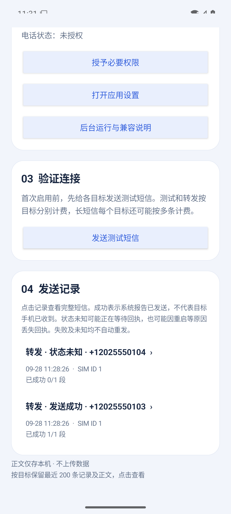
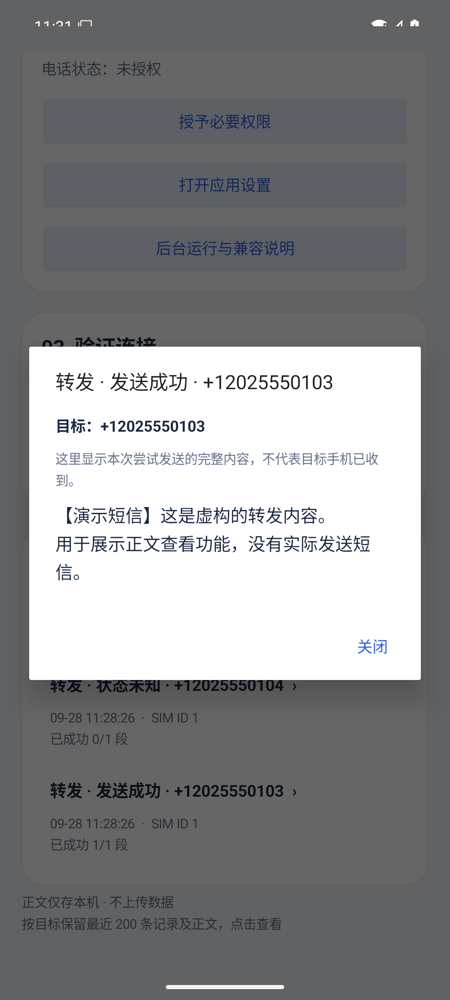

# 短信桥 · SMS Bridge for Android

**让另一台手机的短信，及时到达。**

[English](README.en.md) · [下载 APK](https://github.com/lizhicaho/sms-bridge-android/releases/latest) · [使用说明](docs/使用说明.md) · [反馈问题](https://github.com/lizhicaho/sms-bridge-android/issues/new/choose)

把闲置安卓手机作为短信接收端，将新短信按指定来源或全部短信规则，通过 SIM 卡分别转发到其他手机号。接收端无需安装应用，无需自建服务器。

## 页面预览

以下为 Android 模拟器中实际应用界面的演示截图。使用独立 demo 构建、虚构号码和模拟记录，**没有实际发送短信，也不代表真机验收结果**。

  
  
  
  

[操作演示](docs/images/walkthrough.mp4) · [截图生成说明](docs/演示素材.md)

## 能做什么

| 功能 | 行为 |
| --- | --- |
| 指定来源 | 多号码完整匹配，保留 +86；支持换行和中英文逗号 |
| 全部短信 | 显式开启后，转发之后新收到的所有短信；默认关闭 |
| 多个目标 | 每个目标单独提交和记录状态，合并完全重复的号码 |
| 选择 SIM | 固定发送 SIM，失效时不擅自切换卡 |
| 长短信 | 合并收到的分段，再交给系统拆分发送 |
| 记录与详情 | 最近 200 次目标发送尝试及完整正文；区分成功、失败、未知 |
| 重复保护 | 接收事件持久化去重；失败和未知均不自动重发 |
| 无应用联网 | 没有 INTERNET 权限、服务器或统计 SDK |

~~~mermaid
flowchart LR
    A[新短信到达 A 手机] --> B{启用且符合转发范围?}
    B -->|是| C[登记事件与各目标记录]
    C --> D[选定 SIM 发送]
    D --> E[目标手机 1]
    D --> F[目标手机 2]
    B -->|否| G[不转发]
~~~

## 开始使用

1. 从 [Releases](https://github.com/lizhicaho/sms-bridge-android/releases) 下载正式 APK，安装到 A 手机。
2. 授予接收短信、发送短信、电话状态权限。
3. 选择转发范围，填写目标号码，选择发送 SIM 并保存。
4. 发送测试短信，在每个目标手机确认实际收到后，再启用自动转发。
5. 按手机系统设置允许自启动和后台活动；重启后先解锁，强行停止后需重新打开。

**多目标与长短信可能产生多份短信费用。** 不要将 A 手机自身设为目标，不要让两台手机相互转发。全部模式也会转发私人短信和验证码。仅在自己拥有或得到授权的设备上使用。

## 兼容与已知限制

- 最低 Android 8.0（API 26）；编译与目标 API 35。小米及支持安卓应用的华为是目标设备，尚未建立机型认证列表。
- HarmonyOS 5 及以上不承诺支持；本项目不是 iOS 应用。
- 系统/厂商可能延迟或限制短信广播和验证码读取，普通短信成功不代表所有验证码可用。
- 不读取历史短信，不支持 MMS、RCS 或 iMessage；没有隐私发送模式，不隐藏或删除系统发件记录。
- “发送成功”是系统发送回执，不等于对方收到。中途崩溃可能遗漏部分目标，不会自动补发。
- 自动化测试不能替代双卡、后台、锁屏及实际运营商验收。[验收表](docs/真机验收.md)

## 数据与权限

三项权限分别用于接收新短信、SIM 发送和读取可用 SIM。没有 READ_SMS 或 INTERNET 权限。

设置和最近 200 次发送尝试的**完整正文（可能含验证码）**存于应用私有目录；应用关闭备份。去重指纹独立保留。系统短信应用与运营商仍可能保留发送记录。卸载/清除数据会删除配置与记录。

正式包启用安全窗口标记，限制截图和最近任务预览；用于仓库截图的 demo 包移除了所有短信权限及接收器。详见 [安全说明](SECURITY.md)。

## 开发

JDK 17 · Gradle 8.13 · AGP 8.9.2 · Kotlin 2.1.20 · SDK 35 / Build Tools 35.0.0。

设置 ANDROID_HOME 或本机 local.properties 后运行：

~~~sh
./gradlew testDebugUnitTest lintDebug assembleRelease
ANDROID_HOME=/path/to/android-sdk scripts/package-local.sh
~~~

release 构建默认未签名。首次签名生成的密钥位于 .signing/，必须私下备份，不可提交。自行签名构建不能覆盖其他签名的安装包。官方发布沿用原签名，升级无需卸载。

~~~text
app/src/main/       接收、规则、发送、SQLite 和界面
app/src/test/       核心逻辑和 Robolectric 测试
app/src/demo/       无短信权限的演示构建
docs/              使用、验收和推广素材
scripts/           本地签名及演示工具
~~~

[贡献指南](CONTRIBUTING.md) · [更新日志](CHANGELOG.md) · [第三方声明](THIRD_PARTY_NOTICES.md)

## 许可证

[MIT](LICENSE)。欢迎提交脱敏后的机型兼容反馈、问题修复和文档改进。
